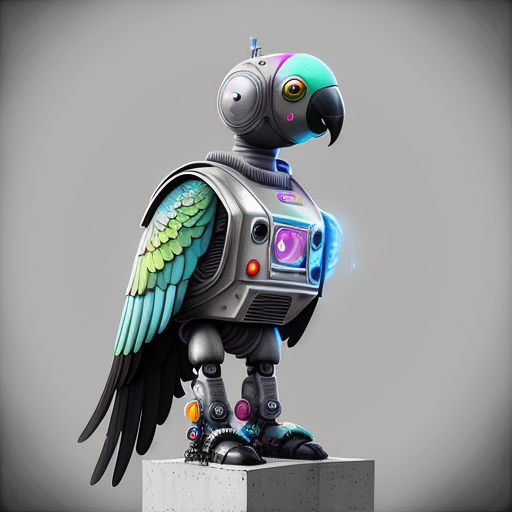
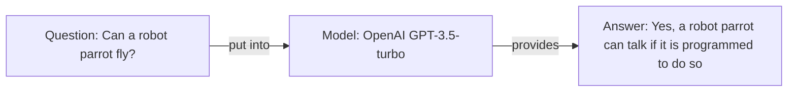

<h1 align="center">learn langchainjs</h1>

<p align="center"></p>

<p align="center">Getting started with LangChain for JavaScript / TypeScript developers.</p>

---

<!-- AUTO-GENERATED-CONTENT:START (TOC) -->
- [Prerequisites (optional)](#prerequisites-optional)
- [Introduction](#introduction)
  - [What is LangChain?](#what-is-langchain)
  - [Use Cases](#use-cases)
- [Main Quest: Help RoboAlex to Talk](#main-quest-help-roboalex-to-talk)
  - [Chapter 1: Answer a simple question](#chapter-1-answer-a-simple-question)
    - [Components](#components)
    - [Flowchart](#flowchart)
    - [Code](#code)
    - [Run Example](#run-example)
    - [Challenge](#challenge)
- [Ask RoboAlex](#ask-roboalex)
<!-- AUTO-GENERATED-CONTENT:END -->

---

## Prerequisites (optional)

If you'd like to run the examples locally or complete all the challenges, you'll need to have
Node.js installed and follow these steps:

1. Clone the repository to your computer and navigate to the `learn-langchainjs` folder
2. Install the dependencies by running `npm i`
3. Make a copy of the `.env.example` file and create a new file named `.env`
   1. Add your `OPENAI_API_KEY` to the `.env` file
   2. (Optional) Change the `OPENAI_GPT_MODEL` value to `gpt-4` if you prefer not to use the default
      `gpt-3.5-turbo` model

---

## Introduction

### What is LangChain?

LangChain is a framework that enables applications to harness language models, allowing them to
connect with various data sources and interact with their environment. Find more in the official
[documentation](https://js.langchain.com/docs/) and
[repository](https://github.com/hwchase17/langchainjs).

It offers a variety of components to choose from:

- **Model**: Integrates with language and chat models for language understanding and generation
- **Prompt**: Handles language model inputs with templates and related functionalities
- **Agent**: Makes decisions, interacts with the environment, and repeats actions until task
  completion
- **Chain**: Combines sequences of calls for complex workflows and applications
- **Index**: Prepares data for interaction with language models through various functionalities
- **Memory**: Persists state between calls, allowing context retention in chains or agents
- **Schema**: Provides interfaces and base classes for library structure and organization

### Use Cases

Let's explore some real-world use cases where you could use LangChain:

1. **Sentiment Analysis**: Analyze the mood in user-generated content like reviews or social media
   posts.
2. **Text Summarization**: Generate concise summaries of long articles or documents.
3. **Content Generation**: Create content, such as articles or social media updates, based on user
   preferences.
4. **Question-Answering System**: Build a system that accurately answers questions based on a given
   dataset.
5. **Chatbot**: Develop a context-aware chatbot that understands and responds to user queries.

## Main Quest: Help RoboAlex to Talk


Meet RoboAlex, an advanced robot parrot with state-of-the-art features. RoboAlex's body is designed
to mimic the appearance and movements of a real parrot. However, there's one crucial element
missing: the brain.

Our goal is to give RoboAlex the power of artificial intelligence, enabling it to communicate with
us and interact with its environment. By helping RoboAlex to talk, we'll bring this extraordinary
robotic parrot to life, demonstrating the incredible potential of LangChainJS in the process.

Bonus: When we are done, RoboAlex will also be able to answer any LangChainJS-related questions for
us. If you want to check this out directly, please refer to the [Ask RoboAlex](#ask-roboalex)
section that comes together with this repository.

### Chapter 1: Answer a simple question

Our robot should be able to answer a simple **question**, so we have to add a brain, which is
represented by an LLM (Large Language Model), we call it **model**. In langchainjs we can choose
from a variety of different models (like OpenAI or Anthropic), but we will not go into depth about
what the differences are between them.

#### Components

- Model

#### Flowchart



#### Code

<!-- AUTO-GENERATED-CONTENT:START (CODE:src=./src/examples/000_prompt.ts) -->
<!-- The below code snippet is automatically added from ./src/examples/000_prompt.ts -->
```ts
import { config } from "dotenv";
import { OpenAI } from "langchain/llms/openai";

// Load environment variables, especially OPENAI_API_KEY
config();

export async function run() {
	const question = "Can a robot parrot talk?";

	// Create a new instance of the OpenAI model
	// modelName: "gpt-3.5-turbo" - Use the GPT-3.5 Turbo model
	// temperature: 0.2 - Use a low temperature value for less randomness in the output
	const model = new OpenAI({ modelName: "gpt-3.5-turbo", temperature: 0.2 });

	// Use the "model" to ask the "question"
	// and store the "response" in a variable
	const response = await model.call(question);

	console.log(response);
}

run();
```
<!-- AUTO-GENERATED-CONTENT:END -->

#### Run Example

```
npx ts-node-esm ./src/examples/000_prompt.ts
```

#### Challenge

- Update the **question** to anything you would like to know and see what the robot is responding
- Which influence will a temperature of `1.0` have on the answer?

---

## Ask RoboAlex

To set up and use the CLI to interact with RoboAlex and get answers to LangChainJS-related
questions, follow the steps in the [Prerequisites (optional)](#prerequisites-optional) section.

Once you've completed the setup, you can start the interactive CLI app by running `npm start`. This
will enable you to ask RoboAlex questions about LangChainJS and explore its capabilities as you
progress through the guide.
